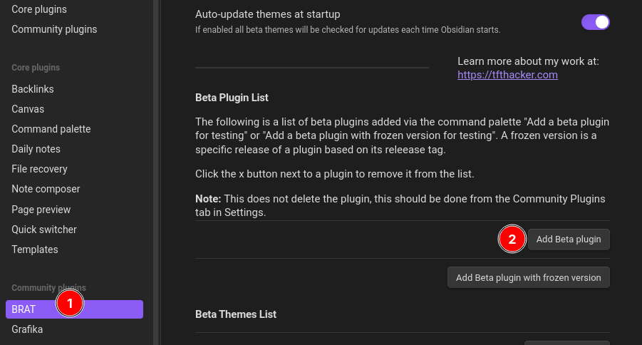
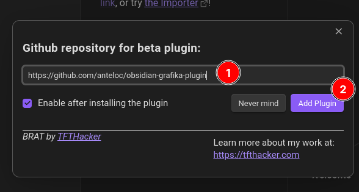
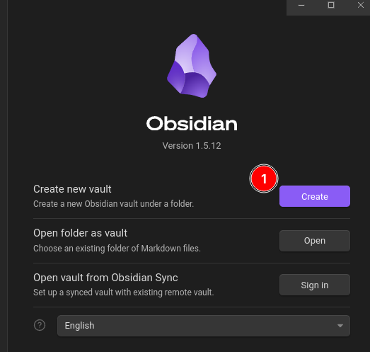
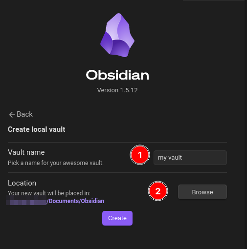
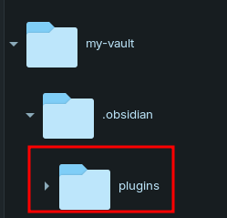
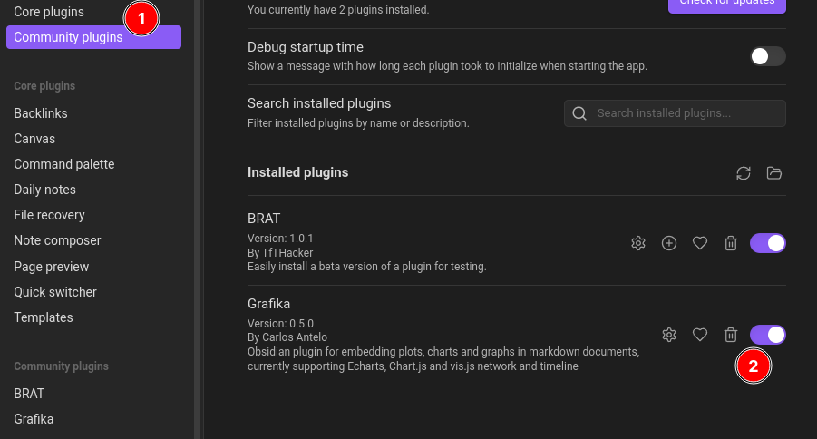

# Expair

> [!WARNING]
> This plugin is still at an **experimental** **Proof-of-Concept (POC)** stage.
> Even though this plugin is stable enough to try and use, _performance_ 
> and _usability_ are still **WIP**.

This is an **Obsidian plugin** for TBD

## Features

TBD animated gifs?

- **Feature 1** TBD
- **Feature 2** TBD
- **Feature 3** TBD
		
> [!IMPORTANT]
> **OpenAI Analysis** feature requires:
> - An **OpenAI account** and **API Key**.
> -  Access to **gpt-4 models** via **OpenAI's API**

## Try It!

TBD

### Setup

1. [Install Expair](#How%20to%20Install)

#### Video

A short video showing:

- **Demo action 1** TBD
- **Demo action 2** TBD
- **Demo action 3** TBD

TBD [](https://www.youtube.com/watch?v=changeme "Expair Demo Video")


## How to Install

There are currently two supported methods for installing this plugin:

### Method 1 - BRAT (Recommended)

**TBD No BRAT support yet!**

1. Install **BRAT Plugin** from the **Community Plugins** in Obsidian

2. In **Obsidian's Settings**
	1. **BRAT > Add Beta Plugin > Github repository for...** 
	2. Set to: https://github.com/anteloc/obsidian-expair-plugin
	3. Restart **Obsidian**






### Method 2 - Manual install 

- **Requirements**: 
	- Node.js **v20.x**

1. In **Obsidian**, create a new vault with name: `my-vault` 





2. **If it doesn't exist**, create a new `plugins` folder under your vault's `.obsidian` folder. 
	- On some systems, this `.obsidian` folder will be **hidden**.



3. Open a terminal and `cd` to the **plugins** folder for your vault:

**MacOS and Linux**
```shell
cd path/to/Documents/Obsidian/my-vault/.obsidian/plugins
```

**Windows**
```shell
cd path\to\Documents\Obsidian\my-vault\.obsidian\plugins
```

4. Clone and build **Expair's repository**:
```shell
git clone https://github.com/anteloc/obsidian-expair-plugin.git
cd obsidian-expair-plugin
npm install
```

5. Open your `my-vault` in **Obsidian** and [Turn on community plugins](https://help.obsidian.md/Extending+Obsidian/Community+plugins#Browse+community+plugins) if required.

6. In **Obsidian's Settings**, enable **Expair** if required and **restart Obsidian** afterwards:




## Support

If you are currently enjoying this plugin, and maybe has saved you **time and effort** worth inviting me a coffee, consider **supporting** my work by **buying me one**!

TBD Update projects at landing page
[](https://www.buymeacoffee.com/anteloc)

## Acknowledgements
**TBD**